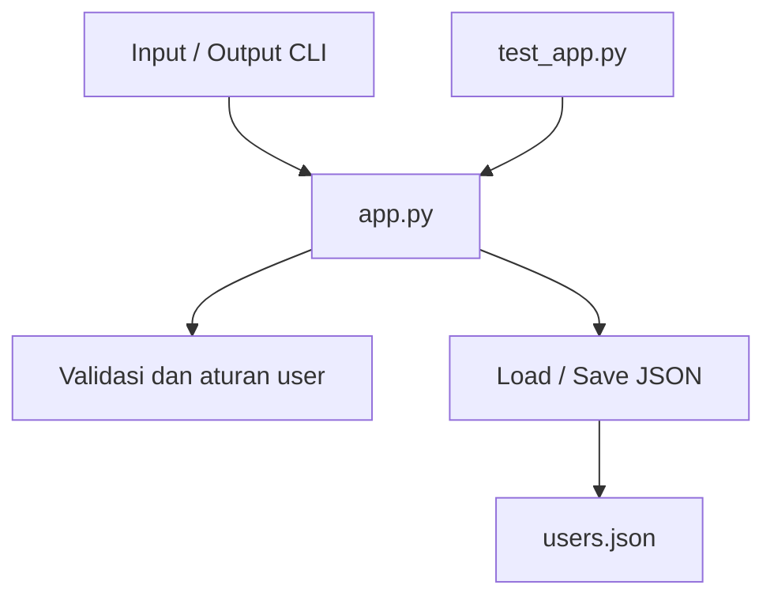
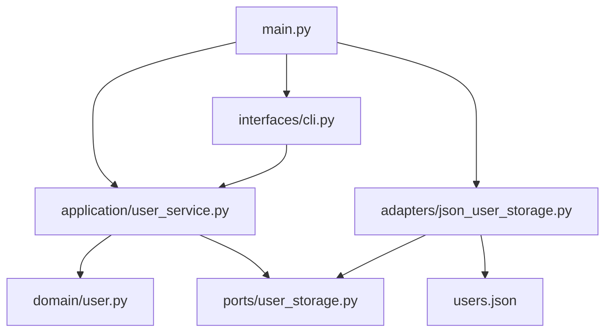

# Pecah Proyek Monolitik

**Mata Kuliah:** Software Development Fundamentals  
**Kelas:** SDF05  
**Nama:** MUH. AWALUDDIN  
**NIM:** 25120300003

Project awal hanya terdiri dari satu file `app.py`. Di dalam file tersebut, proses validasi user, pembuatan user, baca/tulis JSON, dan CLI masih berada di tempat yang sama. Pada refactoring ini, bagian-bagian tersebut dipisahkan agar tanggung jawab setiap module lebih jelas dan lebih mudah diuji.

## 1. Dependency Map

### Sebelum refactoring



Pada versi awal, hampir semua proses bergantung pada `app.py`. Fungsi validasi, pembuatan user, akses file, dan CLI berada dalam satu module. Karena itu, perubahan pada penyimpanan atau CLI bisa ikut memengaruhi bagian lain yang sebenarnya tidak berhubungan langsung.

### Sesudah refactoring



Setelah dipisahkan, CLI hanya menangani input dan output. `UserService` mengatur proses pembuatan user, sedangkan aturan user berada di `domain/user.py`. Akses file JSON dipindahkan ke `JsonUserStorage`. Dengan struktur ini, domain tidak perlu mengetahui bagaimana data disimpan atau bagaimana user berinteraksi dengan program.

## 2. Pembagian Module

### `domain/user.py`

Berisi aturan utama untuk user:

- validasi nama,
- validasi email,
- normalisasi nama dan email,
- pengecekan email yang sudah digunakan,
- pembuatan ID user.

Module ini tidak membaca file dan tidak menangani `input()` atau `print()`.

### `ports/user_storage.py`

Berisi interface `UserStorage` dengan dua operasi:

```python
load_users()
save_users(users)
```

`UserService` memakai interface ini, jadi service tidak perlu tahu apakah data disimpan di file JSON atau menggunakan cara penyimpanan lain.

### `adapters/json_user_storage.py`

Berisi implementasi penyimpanan menggunakan file JSON. Proses membaca dan menulis `users.json` hanya dilakukan di module ini.

### `application/user_service.py`

Berisi alur pembuatan user. Service mengambil data dari storage, menjalankan aturan dari domain, lalu menyimpan kembali data melalui `UserStorage`.

### `interfaces/cli.py`

Berisi bagian yang berhubungan dengan terminal, yaitu `input()` dan `print()`. Dengan begitu, kode domain tidak tercampur dengan tampilan CLI.

### `main.py`

Menjadi file utama untuk menghubungkan `JsonUserStorage`, `UserService`, dan CLI saat program dijalankan.

## 3. Arah Dependency

```text
CLI --------> UserService --------> Domain
                 |
                 v
          UserStorage Interface
                 ^
                 |
          JSON Storage Adapter
```

Hal yang penting dari struktur ini adalah `UserService` tidak meng-import `JsonUserStorage` secara langsung. `UserService` hanya membutuhkan `UserStorage`. Jadi jika cara penyimpanan diganti, bagian domain dan service tidak perlu ikut diubah.

## 4. Update Test

Test juga dipisahkan mengikuti module yang diuji:

- `tests/test_domain.py` menguji validasi dan aturan user.
- `tests/test_user_service.py` menggunakan `FakeUserStorage` supaya service dapat diuji tanpa membuat file JSON.
- `tests/test_json_user_storage.py` menguji proses simpan dan baca file JSON menggunakan temporary directory dari pytest.

Dengan pembagian ini, saat sebuah test gagal, bagian yang bermasalah lebih mudah ditemukan. Test domain juga dapat dijalankan tanpa bergantung pada file system atau CLI.

## 5. Manfaat Setelah Refactoring

Setelah refactoring:

- setiap module memiliki tugas yang lebih jelas,
- domain logic dapat diuji tanpa akses file,
- kode penyimpanan tidak bercampur dengan aturan user,
- implementasi storage lebih mudah diganti,
- CLI dapat diubah tanpa mengubah domain,
- file menjadi lebih kecil dan lebih mudah dibaca.

## Struktur Project

```text
sdf05-monolith-refactoring/
├── adapters/
│   ├── __init__.py
│   └── json_user_storage.py
├── application/
│   ├── __init__.py
│   └── user_service.py
├── domain/
│   ├── __init__.py
│   └── user.py
├── interfaces/
│   ├── __init__.py
│   └── cli.py
├── ports/
│   ├── __init__.py
│   └── user_storage.py
├── tests/
│   ├── test_domain.py
│   ├── test_json_user_storage.py
│   └── test_user_service.py
├── main.py
├── users.json
├── requirements-dev.txt
└── README.md
```

